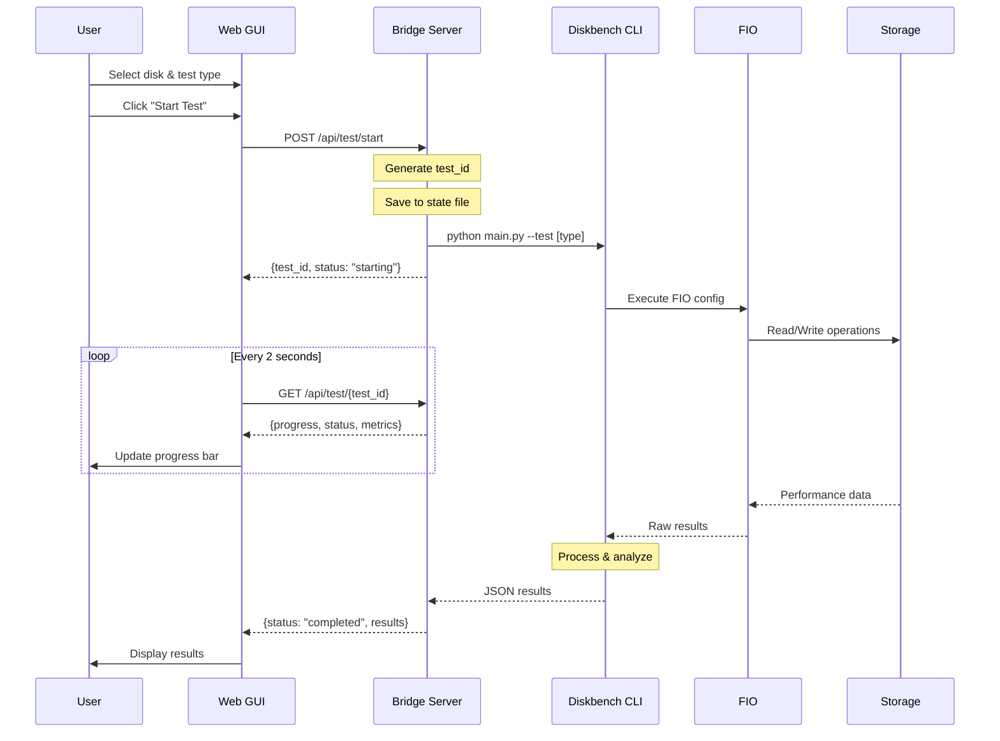
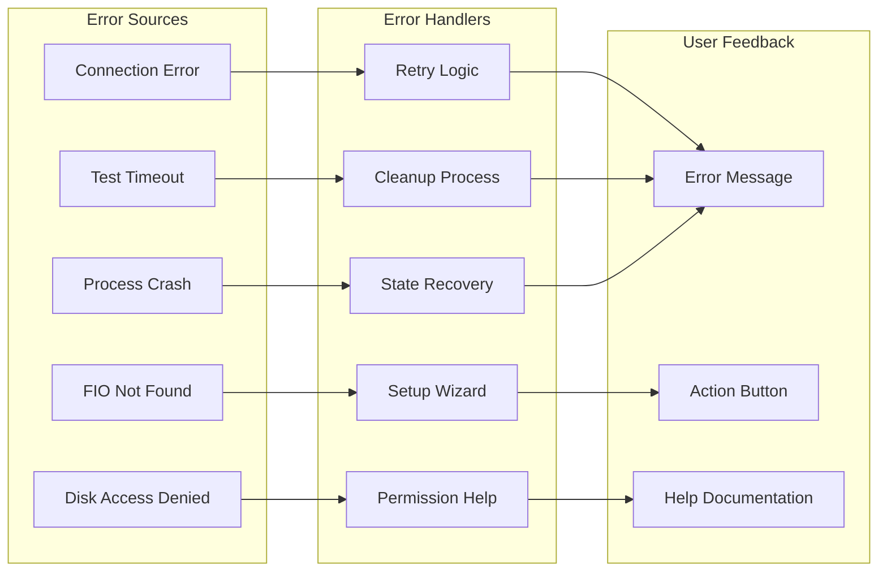
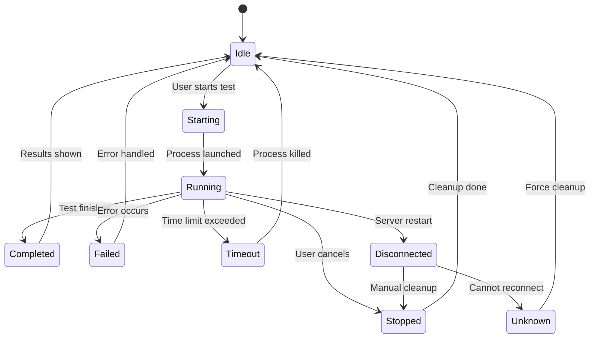
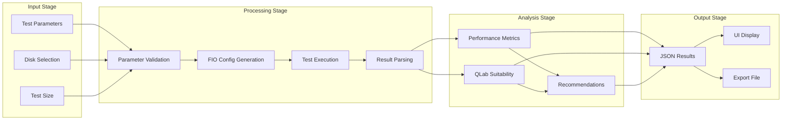

# QLab Disk Performance Tester - Visual Flow Diagram

## Complete System Information Flow

```mermaid
graph TB
    %% User Interface Layer
    subgraph "Web GUI (localhost:8080)"
        UI[User Interface]
        APP[app.js]
        UI --> APP
    end

    %% Bridge Server Layer
    subgraph "Bridge Server (localhost:8081)"
        API[HTTP API Handler]
        PM[Process Manager]
        STATE[State Persistence]
        API --> PM
        PM --> STATE
    end

    %% Diskbench CLI Layer
    subgraph "Diskbench CLI"
        MAIN[main.py]
        CMD[Commands]
        FIO[FIO Runner]
        PATTERNS[Test Patterns]
        MAIN --> CMD
        CMD --> FIO
        CMD --> PATTERNS
    end

    %% System Layer
    subgraph "System Resources"
        DISK[Disk Storage]
        FIOB[FIO Binary]
        FIO --> FIOB
        FIOB --> DISK
    end

    %% Main Flow Connections
    APP -->|HTTP Requests| API
    PM -->|subprocess.run| MAIN
    
    %% Specific Operations
    APP -->|GET /api/disks| API
    APP -->|POST /api/test/start| API
    APP -->|GET /api/test/{id}| API
    APP -->|POST /api/test/stop| API
    
    %% Data Flow Back
    API -.->|JSON Response| APP
    MAIN -.->|JSON Output| PM
    FIO -.->|Test Results| CMD
    DISK -.->|Performance Data| FIOB
```

## Detailed Test Execution Sequence



## Error Handling Flow



## State Management Flow



## Data Transformation Pipeline



## Component Communication Matrix

| From | To | Protocol | Data Format | Purpose |
|------|-----|----------|-------------|---------|
| Web GUI | Bridge Server | HTTP/JSON | REST API | Commands & queries |
| Bridge Server | Diskbench | subprocess | CLI args | Test execution |
| Diskbench | FIO | subprocess | Config file | Performance testing |
| FIO | Disk | System I/O | Binary | Actual disk operations |
| Diskbench | Bridge Server | stdout | JSON | Results return |
| Bridge Server | Web GUI | HTTP/JSON | REST API | Status & results |

## Key Information Elements

### 1. Test Configuration
```json
{
    "test_type": "quick_max_mix",
    "disk_path": "/Volumes/TestDisk",
    "size_gb": 10,
    "show_progress": true
}
```

### 2. Progress Update
```json
{
    "test_id": "test_1234567890",
    "status": "running",
    "progress": 45.2,
    "current_phase": "prores_422_playback",
    "elapsed_time": 234,
    "estimated_remaining": 156
}
```

### 3. Test Results
```json
{
    "test_info": {
        "test_mode": "quick_max_mix",
        "disk_path": "/Volumes/TestDisk",
        "timestamp": "2024-01-10T10:35:00"
    },
    "summary": {
        "total_read_iops": 45000,
        "total_write_iops": 15000,
        "total_read_bw": 1800,
        "total_write_bw": 600,
        "avg_read_latency": 0.8,
        "avg_write_latency": 1.2
    },
    "qlab_analysis": {
        "overall_performance": "excellent",
        "qlab_suitable": true,
        "recommended_streams": 8
    }
}
```

## Performance Bottlenecks & Optimizations

1. **Polling Overhead**: 2-second interval balances responsiveness vs. load
2. **JSON Parsing**: Streaming parser for large results
3. **Process Management**: Process groups for reliable cleanup
4. **State Persistence**: Write-through cache with periodic flush
5. **UI Rendering**: Virtual scrolling for large result sets

## Security Boundaries

```
┌─────────────────────────────────────────────────────────┐
│                    User Space                           │
│  ┌─────────────┐                                       │
│  │   Web GUI   │ ← Sandboxed browser environment       │
│  └─────────────┘                                       │
│         ↕ HTTP (localhost only)                        │
│  ┌─────────────┐                                       │
│  │Bridge Server│ ← Python process with limited privs   │
│  └─────────────┘                                       │
│         ↕ subprocess (controlled execution)            │
│  ┌─────────────┐                                       │
│  │  Diskbench  │ ← Validated paths, sanitized inputs   │
│  └─────────────┘                                       │
└─────────────────────────────────────────────────────────┘
           ↕ System calls (FIO)
┌─────────────────────────────────────────────────────────┐
│                   System Space                          │
│  ┌─────────────┐                                       │
│  │     FIO     │ ← Direct I/O operations               │
│  └─────────────┘                                       │
│         ↕                                              │
│  ┌─────────────┐                                       │
│  │Disk Hardware│ ← Physical storage access             │
│  └─────────────┘                                       │
└─────────────────────────────────────────────────────────┘
```
