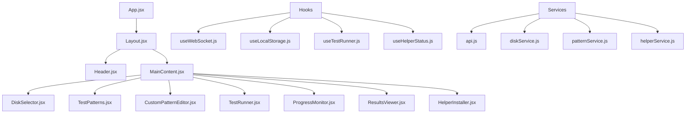

# GUI Context

## Architecture Transition: PyQt6 → React Web Interface

The project has transitioned from a PyQt6 desktop application to a **React-based web interface** served by a Flask backend. This change addresses sandbox limitations while providing a modern, responsive user experience.

## New Web Interface Architecture

### Technology Stack
- **Frontend**: React 18+ with modern hooks and functional components
- **Backend**: Python Flask with Flask-SocketIO for real-time communication
- **Styling**: CSS Modules or Styled Components for component-scoped styling
- **State Management**: React Context API with useReducer for complex state
- **Real-time Updates**: WebSocket connection for live test progress
- **Local Storage**: Browser localStorage for custom pattern persistence
- **Build System**: Create React App or Vite for development and production builds

### Component Architecture



## Core Components

### 1. DiskSelector Component
**Purpose**: Disk selection and information display
**Features**:
- Real-time disk detection via API
- Disk type identification (SSD/HDD/External)
- Capacity and free space display
- Mount point and device path information
- Visual indicators for disk health and compatibility

```jsx
// Key functionality
const DiskSelector = () => {
  const [disks, setDisks] = useState([]);
  const [selectedDisk, setSelectedDisk] = useState(null);
  
  // Real-time disk detection
  useEffect(() => {
    const fetchDisks = async () => {
      const response = await api.get('/api/disks');
      setDisks(response.data);
    };
    fetchDisks();
    const interval = setInterval(fetchDisks, 5000);
    return () => clearInterval(interval);
  }, []);
  
  return (
    <div className="disk-selector">
      {disks.map(disk => (
        <DiskCard 
          key={disk.id}
          disk={disk}
          selected={selectedDisk?.id === disk.id}
          onSelect={setSelectedDisk}
        />
      ))}
    </div>
  );
};
```

### 2. TestPatterns Component
**Purpose**: Built-in test pattern library and selection
**Features**:
- QLab ProRes 422/HQ patterns
- Setup check and max sustained tests
- Pattern descriptions and duration estimates
- Visual pattern categorization
- Quick pattern comparison

```jsx
const TestPatterns = ({ onPatternSelect, selectedPattern }) => {
  const builtInPatterns = [
    {
      id: 'setup_check',
      name: 'Setup Check',
      description: '30-second validation test',
      duration: '30s',
      category: 'validation',
      icon: '🔍'
    },
    {
      id: 'qlab_prores_422',
      name: 'QLab ProRes 422',
      description: '2.5-hour thermal test (656→2100 MB/s)',
      duration: '2.5h',
      category: 'qlab',
      icon: '🎬'
    },
    // ... more patterns
  ];
  
  return (
    <div className="test-patterns">
      <h3>Built-in Test Patterns</h3>
      <div className="pattern-grid">
        {builtInPatterns.map(pattern => (
          <PatternCard
            key={pattern.id}
            pattern={pattern}
            selected={selectedPattern?.id === pattern.id}
            onSelect={onPatternSelect}
          />
        ))}
      </div>
    </div>
  );
};
```

### 3. CustomPatternEditor Component
**Purpose**: FIO syntax editor for custom test patterns
**Features**:
- Syntax highlighting for FIO parameters
- Real-time validation and error highlighting
- Pattern templates and examples
- Save/load custom patterns
- Import/export functionality

```jsx
const CustomPatternEditor = ({ onPatternSave }) => {
  const [fioConfig, setFioConfig] = useState('');
  const [validationErrors, setValidationErrors] = useState([]);
  const [savedPatterns, setSavedPatterns] = useLocalStorage('customPatterns', []);
  
  const validateFioSyntax = (config) => {
    // FIO syntax validation logic
    const errors = [];
    const lines = config.split('\n');
    
    lines.forEach((line, index) => {
      if (line.trim() && !line.startsWith('#')) {
        if (!line.includes('=') && !line.startsWith('[')) {
          errors.push(`Line ${index + 1}: Invalid FIO parameter format`);
        }
      }
    });
    
    return errors;
  };
  
  useEffect(() => {
    const errors = validateFioSyntax(fioConfig);
    setValidationErrors(errors);
  }, [fioConfig]);
  
  return (
    <div className="custom-pattern-editor">
      <div className="editor-header">
        <h3>Custom Pattern Editor</h3>
        <button onClick={() => setFioConfig(TEMPLATE_CONFIGS.basic)}>
          Load Template
        </button>
      </div>
      
      <textarea
        value={fioConfig}
        onChange={(e) => setFioConfig(e.target.value)}
        className={`fio-editor ${validationErrors.length > 0 ? 'has-errors' : ''}`}
        placeholder="Enter FIO configuration..."
      />
      
      {validationErrors.length > 0 && (
        <div className="validation-errors">
          {validationErrors.map((error, index) => (
            <div key={index} className="error">{error}</div>
          ))}
        </div>
      )}
      
      <div className="editor-actions">
        <button 
          onClick={() => onPatternSave({ fioConfig, name: 'Custom Pattern' })}
          disabled={validationErrors.length > 0}
        >
          Save Pattern
        </button>
      </div>
    </div>
  );
};
```

### 4. TestRunner Component
**Purpose**: Test execution control and monitoring
**Features**:
- Start/stop test execution
- Real-time progress tracking
- Phase-based progress display
- ETA calculations
- Test cancellation handling

```jsx
const TestRunner = ({ selectedDisk, selectedPattern }) => {
  const [isRunning, setIsRunning] = useState(false);
  const [progress, setProgress] = useState(0);
  const [currentPhase, setCurrentPhase] = useState('');
  const [eta, setEta] = useState('');
  
  const { socket } = useWebSocket();
  
  useEffect(() => {
    if (socket) {
      socket.on('test_progress', (data) => {
        setProgress(data.progress);
        setCurrentPhase(data.phase);
        setEta(data.eta);
      });
      
      socket.on('test_complete', (data) => {
        setIsRunning(false);
        // Handle test completion
      });
    }
  }, [socket]);
  
  const startTest = async () => {
    if (!selectedDisk || !selectedPattern) return;
    
    setIsRunning(true);
    try {
      await api.post('/api/tests/start', {
        disk: selectedDisk.id,
        pattern: selectedPattern.id,
        config: selectedPattern.fioConfig
      });
    } catch (error) {
      setIsRunning(false);
      console.error('Test start failed:', error);
    }
  };
  
  return (
    <div className="test-runner">
      <div className="test-controls">
        <button 
          onClick={startTest}
          disabled={!selectedDisk || !selectedPattern || isRunning}
          className="start-button"
        >
          {isRunning ? 'Running...' : 'Start Test'}
        </button>
        
        {isRunning && (
          <button onClick={stopTest} className="stop-button">
            Stop Test
          </button>
        )}
      </div>
      
      {isRunning && (
        <div className="progress-display">
          <div className="progress-bar">
            <div 
              className="progress-fill" 
              style={{ width: `${progress}%` }}
            />
          </div>
          <div className="progress-info">
            <span>Phase: {currentPhase}</span>
            <span>ETA: {eta}</span>
          </div>
        </div>
      )}
    </div>
  );
};
```

### 5. ProgressMonitor Component
**Purpose**: Real-time test progress visualization
**Features**:
- Live throughput charts
- IOPS and latency displays
- Temperature monitoring
- Phase progress indicators
- Performance trend analysis

```jsx
const ProgressMonitor = () => {
  const [metrics, setMetrics] = useState({
    throughput: 0,
    iops: 0,
    latency: 0,
    temperature: 0
  });
  const [chartData, setChartData] = useState([]);
  
  const { socket } = useWebSocket();
  
  useEffect(() => {
    if (socket) {
      socket.on('performance_update', (data) => {
        setMetrics(data.current);
        setChartData(prev => [...prev.slice(-50), {
          timestamp: Date.now(),
          throughput: data.current.throughput,
          iops: data.current.iops
        }]);
      });
    }
  }, [socket]);
  
  return (
    <div className="progress-monitor">
      <div className="metrics-grid">
        <MetricCard 
          title="Throughput" 
          value={`${metrics.throughput.toFixed(1)} MB/s`}
          icon="📊"
        />
        <MetricCard 
          title="IOPS" 
          value={metrics.iops.toLocaleString()}
          icon="⚡"
        />
        <MetricCard 
          title="Latency" 
          value={`${metrics.latency.toFixed(2)} ms`}
          icon="⏱️"
        />
        <MetricCard 
          title="Temperature" 
          value={`${metrics.temperature}°C`}
          icon="🌡️"
        />
      </div>
      
      <div className="performance-chart">
        <LineChart data={chartData} />
      </div>
    </div>
  );
};
```

### 6. ResultsViewer Component
**Purpose**: Test results analysis and display
**Features**:
- QLab-specific performance analysis
- Suitability ratings and recommendations
- Detailed phase breakdowns
- Export functionality
- Historical result comparison

```jsx
const ResultsViewer = ({ testResults }) => {
  const [analysisData, setAnalysisData] = useState(null);
  
  useEffect(() => {
    if (testResults) {
      // Process results for QLab analysis
      const analysis = analyzeQLabPerformance(testResults);
      setAnalysisData(analysis);
    }
  }, [testResults]);
  
  if (!analysisData) return null;
  
  return (
    <div className="results-viewer">
      <div className="results-header">
        <h2>Test Results</h2>
        <div className={`overall-rating ${analysisData.rating.toLowerCase()}`}>
          {analysisData.rating === 'EXCELLENT' && '🟢'}
          {analysisData.rating === 'GOOD' && '🟡'}
          {analysisData.rating === 'ADEQUATE' && '🟠'}
          {analysisData.rating === 'PROBLEMATIC' && '🔴'}
          {analysisData.rating}
        </div>
      </div>
      
      <div className="analysis-cards">
        <AnalysisCard
          title="QLab Stream Capacity"
          content={`${analysisData.streamCount} concurrent 4K streams`}
          details={analysisData.streamDetails}
        />
        
        <AnalysisCard
          title="Crossfade Performance"
          content={analysisData.crossfadeCapable ? 'Supported' : 'Limited'}
          details={analysisData.crossfadeDetails}
        />
        
        <AnalysisCard
          title="Show Suitability"
          content={analysisData.showType}
          details={analysisData.recommendations}
        />
      </div>
      
      <div className="detailed-results">
        <PhaseResults phases={testResults.phases} />
      </div>
      
      <div className="export-actions">
        <button onClick={() => exportResults(testResults, 'json')}>
          Export JSON
        </button>
        <button onClick={() => exportResults(testResults, 'pdf')}>
          Export PDF Report
        </button>
      </div>
    </div>
  );
};
```

### 7. HelperInstaller Component
**Purpose**: Helper binary installation and status
**Features**:
- Helper binary status detection
- Guided installation process
- Admin privilege handling
- Installation progress tracking
- Error handling and troubleshooting

```jsx
const HelperInstaller = () => {
  const [helperStatus, setHelperStatus] = useState('checking');
  const [installProgress, setInstallProgress] = useState(0);
  
  useEffect(() => {
    checkHelperStatus();
  }, []);
  
  const checkHelperStatus = async () => {
    try {
      const response = await api.get('/api/system/helper-status');
      setHelperStatus(response.data.status);
    } catch (error) {
      setHelperStatus('error');
    }
  };
  
  const installHelper = async () => {
    try {
      setHelperStatus('installing');
      const response = await api.post('/api/system/install-helper');
      
      // Monitor installation progress
      const checkProgress = setInterval(async () => {
        const progressResponse = await api.get('/api/system/install-progress');
        setInstallProgress(progressResponse.data.progress);
        
        if (progressResponse.data.complete) {
          clearInterval(checkProgress);
          setHelperStatus('installed');
        }
      }, 1000);
      
    } catch (error) {
      setHelperStatus('install-failed');
    }
  };
  
  if (helperStatus === 'installed') {
    return (
      <div className="helper-status success">
        <span className="status-icon">✅</span>
        Helper binary installed and ready
      </div>
    );
  }
  
  if (helperStatus === 'missing') {
    return (
      <div className="helper-installer">
        <div className="install-prompt">
          <h3>Helper Binary Required</h3>
          <p>
            The disk testing helper binary needs to be installed to enable 
            real FIO disk testing. This requires administrator privileges.
          </p>
          <button onClick={installHelper} className="install-button">
            Install Helper Binary
          </button>
        </div>
      </div>
    );
  }
  
  if (helperStatus === 'installing') {
    return (
      <div className="helper-installer">
        <div className="install-progress">
          <h3>Installing Helper Binary...</h3>
          <div className="progress-bar">
            <div 
              className="progress-fill" 
              style={{ width: `${installProgress}%` }}
            />
          </div>
          <p>Please enter your administrator password when prompted.</p>
        </div>
      </div>
    );
  }
  
  return (
    <div className="helper-status checking">
      <span className="status-icon">🔄</span>
      Checking helper binary status...
    </div>
  );
};
```

## State Management

### React Context for Global State
```jsx
const AppContext = createContext();

const AppProvider = ({ children }) => {
  const [state, dispatch] = useReducer(appReducer, initialState);
  
  return (
    <AppContext.Provider value={{ state, dispatch }}>
      {children}
    </AppContext.Provider>
  );
};

const initialState = {
  selectedDisk: null,
  selectedPattern: null,
  testResults: null,
  helperStatus: 'checking',
  isTestRunning: false,
  customPatterns: []
};
```

## Real-time Communication

### WebSocket Integration
```jsx
const useWebSocket = () => {
  const [socket, setSocket] = useState(null);
  const [connected, setConnected] = useState(false);
  
  useEffect(() => {
    const newSocket = io('http://localhost:8080');
    
    newSocket.on('connect', () => {
      setConnected(true);
      setSocket(newSocket);
    });
    
    newSocket.on('disconnect', () => {
      setConnected(false);
    });
    
    return () => newSocket.close();
  }, []);
  
  return { socket, connected };
};
```

This React-based web interface provides a modern, responsive user experience while maintaining all the professional disk testing capabilities of the original PyQt6 application. The component-based architecture ensures maintainability and extensibility for future enhancements.
