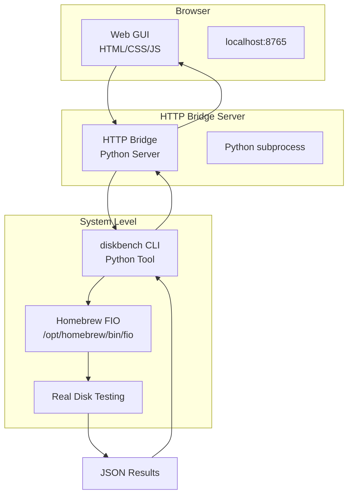

# Technical Context

## Current Architecture: Web GUI + HTTP Bridge + CLI Helper (MVP)

**MVP IMPLEMENTATION**: The project uses a simple Web GUI + Python HTTP Bridge + CLI Helper architecture. Plain HTML/CSS/JS, no React, no Flask, no bundled binaries.



## Technology Stack (MVP)

### Frontend Layer
- **Technology**: Plain HTML5 + CSS3 + Vanilla JavaScript
- **Location**: `web-gui/` directory
- **Communication**: HTTP fetch() to localhost:8765
- **No Framework**: No React, no build process, no bundling
- **Real-time Updates**: HTTP polling for progress updates

### HTTP Bridge Layer
- **Technology**: Python 3 + built-in http.server
- **Location**: `bridge-server/server.py`
- **Purpose**: Translate web requests to diskbench commands
- **Communication**: subprocess calls to diskbench helper
- **Security**: Input validation and parameter sanitization

### Helper Binary Layer
- **Technology**: Python 3 CLI tool
- **Location**: `diskbench/` directory
- **FIO Integration**: Calls system-installed Homebrew FIO ONLY
- **No Fallback**: Pure FIO approach - if FIO fails, honest error reporting
- **Output**: JSON formatted results

### FIO Layer
- **Source**: Homebrew package manager ONLY
- **Installation**: `brew install fio`
- **Location**: `/opt/homebrew/bin/fio` or `/usr/local/bin/fio`
- **No Bundling**: No embedded FIO binaries
- **No Sandbox**: Runs in normal system context

## Core Components (MVP)

### 1. Web GUI (`web-gui/`)
```
web-gui/
├── index.html                    # Main interface
├── styles.css                   # Professional styling
└── app.js                       # JavaScript logic
```

**Key Features:**
- Disk selection dropdown
- Test pattern selection (4 QLab patterns)
- Progress monitoring with real-time updates
- Results display with QLab analysis
- Setup wizard integration

### 2. HTTP Bridge (`bridge-server/`)
```python
# Bridge Server Structure
bridge-server/
└── server.py                    # HTTP server + diskbench bridge
```

**Endpoints:**
- `GET /api/disks` - List available disks
- `GET /api/status` - System status and FIO availability
- `POST /api/setup` - Install/validate FIO
- `POST /api/test/start` - Start disk test
- `GET /api/test/{id}` - Get test progress/results
- `POST /api/validate` - Run validation tests

### 3. Helper Binary (`diskbench/`)
```python
# CLI Structure
diskbench/
├── main.py                      # CLI entry point
├── commands/
│   ├── setup.py                 # FIO installation/validation
│   ├── test.py                  # Test execution
│   ├── list_disks.py           # Disk enumeration
│   └── validate.py             # System validation
├── core/
│   ├── fio_runner.py           # Homebrew FIO execution
│   └── qlab_patterns.py       # Test patterns
└── utils/
    ├── security.py             # Input validation
    ├── logging.py              # Logging
    └── system_info.py          # System detection
```

## FIO Integration Strategy (MVP)

### ✅ Correct Approach: Homebrew FIO Only

```bash
# Installation
brew install fio

# Detection
/opt/homebrew/bin/fio --version    # Apple Silicon
/usr/local/bin/fio --version       # Intel
```

### ❌ What We DON'T Do

- **No bundled FIO**: No embedded binaries in app package
- **No shared memory "fixes"**: Don't try to solve macOS SHM issues with flags
- **No sandbox FIO**: FIO runs in normal system context
- **No embedded execution**: FIO called via subprocess from bridge server

### ✅ What We DO

1. **Guide users to install Homebrew FIO**
2. **Detect system-installed FIO paths**
3. **Use simple FIO configurations that work on macOS**
4. **Report honest errors when FIO fails**
5. **Report honest status about FIO limitations**

## Data Flow Architecture (MVP)

### 1. System Setup Flow
```
User opens web-gui/index.html
    ↓ HTTP GET /api/status
Bridge server checks for Homebrew FIO
    ↓ subprocess: brew --version && which fio
Returns honest status: FIO available but limited
    ↓ User clicks "Install FIO"
Bridge executes: brew install fio
    ↓ Real installation status returned
Web GUI shows honest result: "FIO installed with macOS limitations"
```

### 2. Test Execution Flow
```
User selects disk + pattern in Web GUI
    ↓ HTTP POST /api/test/start
Bridge server validates parameters
    ↓ subprocess: python diskbench/main.py --test qlab_mixed --disk /dev/disk1s1
Helper binary executes Homebrew FIO
    ↓ If FIO fails: returns honest error message
Returns JSON results or error details
    ↓ HTTP response to Web GUI
Results displayed with QLab performance analysis or error message
```

### 3. Error Handling Flow
```
FIO execution fails with "shm segment" error
    ↓ Helper binary logs real error
Returns detailed error information to user
    ↓ No false success messages
Error message shows: "FIO failed: error: failed to setup shm segment"
    ↓ Honest reporting to user
User understands system limitations and next steps
```

## Security Architecture (MVP)

### Input Validation
- **Disk Paths**: Validate against system disk enumeration
- **Test Parameters**: Whitelist known safe values
- **Command Injection**: Use subprocess with argument lists
- **Path Traversal**: Restrict file operations to specified directories

### Privilege Separation
- **Web GUI**: Runs in browser sandbox (no system access)
- **Bridge Server**: Localhost HTTP only (no network access)
- **Helper Binary**: Normal user privileges (no admin required)
- **FIO**: System-installed binary (normal execution context)

### No Admin Privileges Required
- **Installation**: Users install FIO via Homebrew (normal user process)
- **Execution**: All testing runs as normal user
- **File Access**: Uses user-accessible disk paths
- **No Elevation**: No sudo or admin authentication needed

## macOS Integration (MVP)

### Homebrew Integration
```bash
# Check Homebrew availability
brew --version

# Install FIO
brew install fio

# Verify installation
which fio
fio --version
```

### Disk Detection
```python
# System disk enumeration
diskutil list -plist
mount | grep /dev/disk
df -h
```

### Path Handling
```python
# Homebrew paths (Apple Silicon)
/opt/homebrew/bin/fio

# Homebrew paths (Intel)
/usr/local/bin/fio

# System PATH fallback
shutil.which('fio')
```

## Testing Strategy (MVP)

### FIO Testing Approach
1. **Simple configurations first**: Basic read/write tests
2. **Avoid problematic flags**: No shared memory assumptions
3. **File-based testing**: Use temporary files, not raw devices
4. **macOS-compatible engines**: posix, sync engines
5. **JSON output**: Structured results for parsing

### Validation Testing
1. **System capability detection**: What actually works
2. **Honest error reporting**: Real error messages, not fake success
3. **User guidance**: Clear next steps when issues occur
4. **Performance expectations**: Realistic benchmarks for macOS

## Deployment Architecture (MVP)

### Current Structure
```
project/
├── web-gui/                     # HTML/CSS/JS interface
├── bridge-server/               # Python HTTP server
├── diskbench/                   # Python CLI helper
└── memory-bank/                 # Documentation
```

### No Complex Distribution
- **No DMG packaging**: Simple directory structure
- **No app bundles**: Plain Python + HTML files
- **No installers**: Users handle Homebrew installation
- **No bundled binaries**: System-installed FIO only

### User Setup Process
1. Clone/download project files
2. Install Homebrew (if not present)
3. Run `brew install fio`
4. Start bridge server: `python bridge-server/server.py`
5. Open `web-gui/index.html` in browser or go to localhost:8765
6. Follow setup wizard for validation

## QLab Test Patterns (MVP)

### Implemented Test Patterns
1. **Quick Max Speed** (3 minutes)
   - Maximum sequential read/write performance
   - Basic system capability assessment

2. **QLab ProRes 422 Show** (2.75 hours)
   - Realistic show pattern: 1x4K + 3xHD ProRes 422
   - Crossfades every 3 minutes
   - Thermal performance testing

3. **QLab ProRes HQ Show** (2.75 hours)
   - Realistic show pattern: 1x4K + 3xHD ProRes HQ
   - Higher bandwidth requirements
   - Extended thermal testing

4. **Max Sustained** (1.5 hours)
   - Continuous maximum performance
   - Thermal throttling detection
   - Long-term stability assessment

### QLab Analysis Features
- **Stream Capacity**: Calculate concurrent 4K stream capacity
- **Crossfade Performance**: Assess ability to handle overlapping streams
- **Show Suitability**: Rate disk for different show types
- **Thermal Analysis**: Monitor performance degradation over time

## Legacy Components (Not Used in MVP)

### Archived/Not Used ❌
- `qlab_disk_tester/` - PyQt6 GUI components (legacy)
- `disk_tester.py` - Flask app approach (not implemented)
- React components mentioned in old docs (never existed)
- DMG packaging scripts (not needed for MVP)

### MVP Implementation Only ✅
- `web-gui/` - HTML/CSS/JS interface
- `bridge-server/` - Python HTTP server
- `diskbench/` - CLI helper tool
- `memory-bank/` - Documentation

This architecture provides honest, transparent disk testing capabilities while respecting macOS limitations and avoiding complex distribution challenges. The MVP focuses on core functionality with a simple, reliable implementation.
